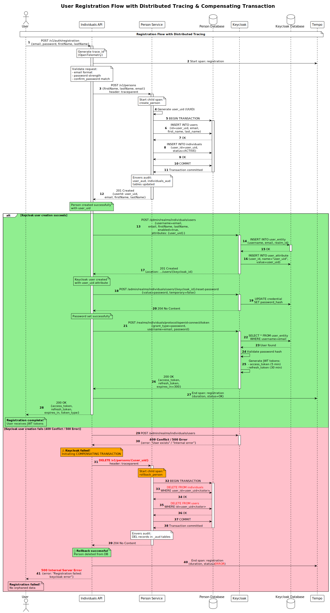

# Architecture Overview — Payment System

Архитектурная документация микросервисной системы управления пользователями.

---

## 📊 Архитектурные диаграммы

### C4 Model Diagrams

Диаграммы созданы по методологии [C4 Model](https://c4model.com) для визуализации архитектуры на разных уровнях абстракции.

#### 1. Context Diagram (Уровень 1)
**Файл**: [docs/architecture/diagrams/context-diagram.svg](docs/architecture/diagrams/context-diagram.svg)

Показывает общую картину системы и взаимодействие с внешними компонентами.


**Ключевые компоненты**:
- 👤 **User** — конечный пользователь
- 🌐 **Individuals API** — оркестратор (аутентификация, регистрация)
- 💾 **Person Service** — управление данными пользователей
- 🔐 **Keycloak** — OAuth2/JWT сервер
- 📊 **Observability Stack** — Prometheus, Grafana, Loki, Tempo
- 📦 **Nexus OSS** — репозиторий Maven артефактов

**Подробнее**: [docs/architecture/c4-context.md](docs/architecture/c4-context.md)

---

#### 2. Container Diagram (Уровень 2)
**Файл**: [docs/architecture/diagrams/container-diagram.svg](docs/architecture/diagrams/container-diagram.svg)

Детализация внутренних контейнеров, технологий и баз данных.


**Технологический стек**:

| Компонент | Технология | Порт |
|-----------|-----------|------|
| **Individuals API** | Spring Boot WebFlux (Reactive) | 8081 |
| **Person Service** | Spring Boot Web + JPA | 8082 |
| **Person DB** | PostgreSQL 16 | 5434 |
| **Keycloak** | Keycloak 26.2 | 8080 |
| **Keycloak DB** | PostgreSQL 17 | 5433 |
| **Nexus OSS** | Nexus 3.75.1 | 8091 |
| **Prometheus** | Prometheus | 9090 |
| **Grafana** | Grafana 10.3 | 3000 |
| **Loki** | Loki 2.9 | 3100 |
| **Tempo** | Tempo 2.6 | 3200 |

**Подробнее**: [docs/architecture/c4-container.md](docs/architecture/c4-container.md)

---

### Sequence Diagrams

#### User Registration Flow
**Файл**: [docs/architecture/diagrams/sequence-registration.svg](docs/architecture/diagrams/sequence-registration.svg)

Полная последовательность шагов при регистрации пользователя с distributed tracing.



**Основные шаги**:
1. User → Individuals API: `POST /v1/auth/registration`
2. API генерирует `trace_id` (OpenTelemetry)
3. API → Person Service: создание Person (транзакционно)
4. Person Service → PostgreSQL: `INSERT users`, `INSERT individuals`
5. API → Keycloak: регистрация пользователя с `user_uid` attribute
6. API → Keycloak: установка пароля
7. API → Keycloak: генерация JWT токенов (access + refresh)
8. API → Tempo: завершение span с полной трассой
9. API → User: возврат JWT tokens

**Подробнее**: [docs/architecture/sequence-registration.md](docs/architecture/sequence-registration.md)

---

## 🏗️ Архитектурные решения

### Микросервисная архитектура

**Разделение ответственности**:
- **individuals-api** — оркестратор, обрабатывает пользовательские запросы
- **person-service** — data service, управляет персональными данными
- **Keycloak** — централизованная аутентификация

**Преимущества**:
- ✅ Независимое масштабирование сервисов
- ✅ Изоляция отказов (failure isolation)
- ✅ Разные технологические стеки (WebFlux vs Web)
- ✅ Независимые циклы разработки

### Reactive vs Blocking

**individuals-api (WebFlux)**:
- Reactive, non-blocking I/O
- Высокая пропускная способность
- Подходит для I/O-intensive операций (HTTP calls к Person Service и Keycloak)

**person-service (Web)**:
- Blocking, традиционный Spring MVC
- Проще в разработке и отладке
- Достаточно для database-heavy операций

### Database per Service

Каждый сервис имеет свою БД:
- **person-service** → `person_db` (PostgreSQL)
- **keycloak** → `keycloak_db` (PostgreSQL)

**Преимущества**:
- ✅ Независимое управление схемой
- ✅ Изоляция данных
- ✅ Возможность выбора разных СУБД

### Distributed Tracing

**OpenTelemetry Java Agent**:
- Автоматическая инструментация HTTP calls
- Минимальные изменения в коде
- Trace ID в логах для корреляции

**Tempo**:
- Хранение и индексация traces
- Интеграция с Grafana
- Поиск по service name, trace ID, duration

**Визуализация**:
```
User Request (trace_id: abc123)
├─ individuals-api [POST /registration] (200ms)
│  ├─ person-service [POST /persons] (80ms)
│  │  └─ PostgreSQL [INSERT users] (20ms)
│  ├─ keycloak [POST /users] (50ms)
│  └─ keycloak [POST /token] (40ms)
```

### Observability Stack

**Три столпа observability**:

1. **Metrics** (Prometheus + Grafana)
    - JVM metrics (heap, threads, GC)
    - HTTP metrics (request rate, latency, errors)
    - Database connection pool metrics

2. **Logs** (Loki + Promtail + Grafana)
    - Structured JSON logging
    - Correlation via trace_id
    - Centralized aggregation

3. **Traces** (Tempo + OpenTelemetry + Grafana)
    - Distributed request tracing
    - Service dependency mapping
    - Performance bottleneck identification

### Artifact Management

**Nexus OSS**:
- Maven repository для `person-service-client`
- Автогенерированный клиент через OpenAPI
- Централизованное управление зависимостями
- Caching для ускорения сборки

**Workflow**:
```
1. OpenAPI spec (person-service.yml)
2. openapi-generator → Java client
3. Gradle publish → Nexus
4. individuals-api → fetch from Nexus
```

### Security

**OAuth2 + JWT**:
- Centralized authentication (Keycloak)
- Stateless JWT tokens (RS256)
- Token rotation (refresh tokens)
- Role-based access control (RBAC)

**Data linking**:
- Keycloak хранит `user_uid` как custom attribute
- person-service использует `user_uid` как primary key
- Связь через UUID, не через email

### Database Audit

**Hibernate Envers**:
- Автоматическое отслеживание изменений
- Таблицы `*_aud` для каждой entity
- Полная история изменений (who, when, what)
- Compliance-ready (GDPR, audit trails)

---

## 📐 Архитектурные паттерны

### 1. API Gateway Pattern
**individuals-api** выступает как API Gateway:
- Единая точка входа для клиентов
- Роутинг к внутренним сервисам
- Аутентификация и авторизация

### 2. Backend for Frontend (BFF)
**individuals-api** адаптирует ответы:
- Агрегация данных из Person Service и Keycloak
- Трансформация DTO для клиентов
- Упрощение клиентской логики

### 3. Database per Service
Изолированные базы данных:
- Независимое управление схемой
- Избежание tight coupling
- Возможность выбора разных СУБД

### 4. Saga Pattern (Choreography)
Регистрация пользователя как распределённая транзакция:
1. Create Person в person-service
2. Create User в Keycloak
3. Set Password в Keycloak
4. Generate Tokens в Keycloak

**Обработка ошибок**: компенсирующие транзакции при сбое на любом шаге.


---

## 🔄 Data Flow

### Registration Flow
```
┌──────┐                                                      
│ User │                                                      
└──┬───┘                                                      
   │ 1. POST /v1/auth/registration                           
   ▼                                                          
┌─────────────────┐                                          
│ Individuals API │                                          
└────┬───┬───┬────┘                                          
     │   │   │                                               
     │   │   │ 2. POST /v1/persons                          
     │   │   ▼                                               
     │   │ ┌──────────────┐    3. INSERT                    
     │   │ │Person Service├────────────► ┌──────────┐        
     │   │ └──────────────┘              │Person DB │        
     │   │                               └──────────┘        
     │   │                                                    
     │   │ 4. POST /admin/users                             
     │   ▼                                                    
     │ ┌─────────┐    5. INSERT                             
     │ │Keycloak ├────────────► ┌──────────┐                 
     │ └────┬────┘              │Keycloak  │                 
     │      │                   │   DB     │                 
     │      │ 6. /reset-password└──────────┘                 
     │      │                                                 
     │      │ 7. /token                                      
     │      ▼                                                 
     │   JWT tokens                                          
     │                                                        
     │ 8. trace → Tempo                                      
     ▼                                                        
  200 OK                                                      
  {access_token, refresh_token}                              
```

---


