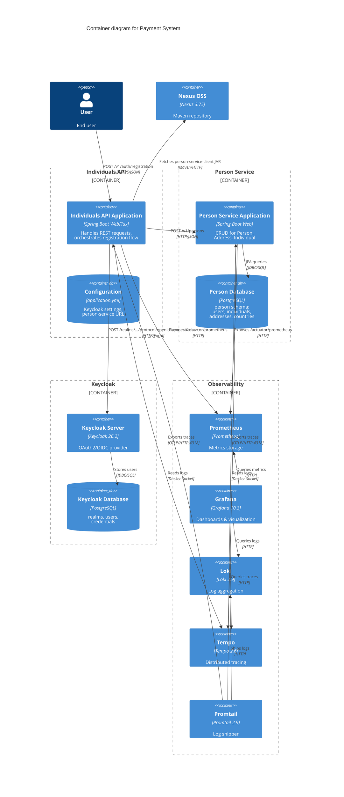

# C4 Container Diagram — Payment System

Диаграмма уровня 2: детализация внутренних контейнеров системы.

## Технологический стек

### Individuals API
- **Framework**: Spring Boot 3.5.0 WebFlux (Reactive)
- **Security**: Spring Security OAuth2 Resource Server
- **Client**: WebClient для вызовов person-service
- **Observability**: Micrometer, OpenTelemetry Java Agent
- **Port**: 8081

### Person Service
- **Framework**: Spring Boot 3.5.0 Web (Blocking)
- **ORM**: Spring Data JPA + Hibernate
- **Audit**: Hibernate Envers
- **Migrations**: Flyway
- **Observability**: Micrometer, OpenTelemetry Java Agent
- **Port**: 8082

### Databases
- **person-postgres**: PostgreSQL 16 (port 5434)
- **keycloak-postgres**: PostgreSQL 17 (port 5433)

### Observability
- **Prometheus**: Port 9090
- **Grafana**: Port 3000
- **Loki**: Port 3100
- **Tempo**: Port 3200, OTLP HTTP 4318, OTLP gRPC 4317

### Artifact Repository
- **Nexus OSS**: Port 8091 (UI), 8092 (Docker registry)