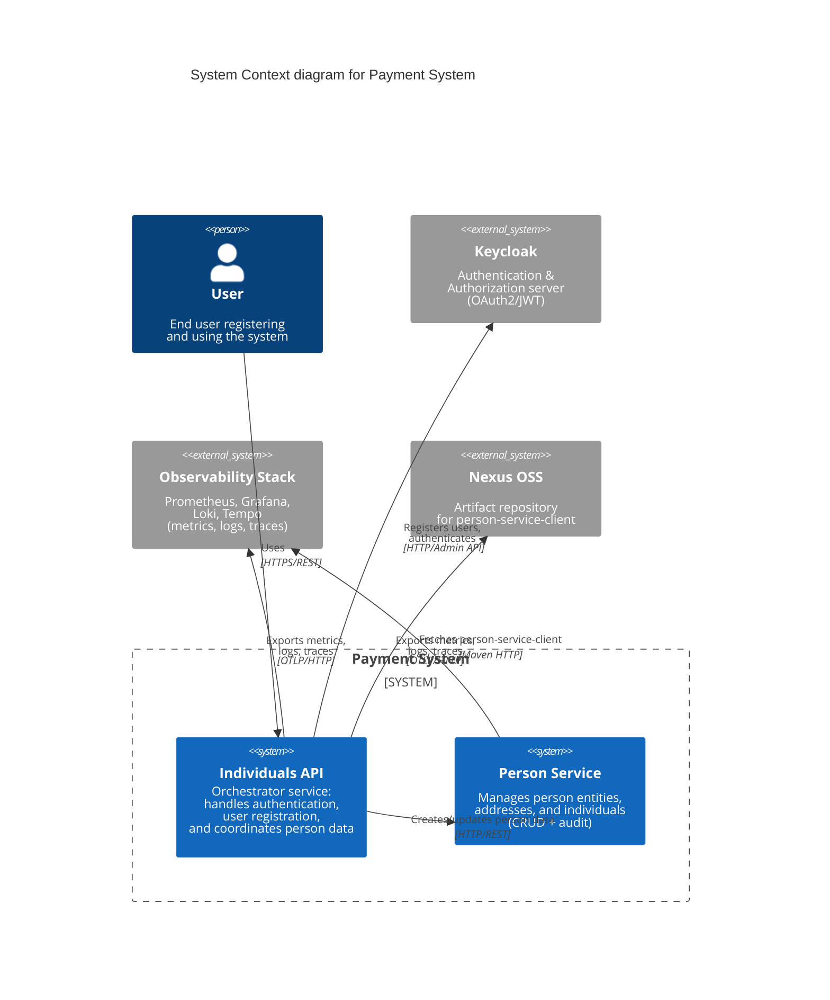

# C4 Context Diagram — Payment System

Диаграмма уровня 1: общий контекст системы и взаимодействие с внешними акторами.

## Описание компонентов

### User
Конечный пользователь, который:
- Регистрируется через `/v1/auth/registration`
- Логинится через `/v1/auth/login`
- Получает JWT токены от Keycloak

### Individuals API
**Роль**: Оркестратор  
**Технологии**: Spring Boot WebFlux, Spring Security OAuth2  
**Функции**:
- Принимает запросы от пользователей
- Создаёт person через person-service
- Регистрирует пользователя в Keycloak
- Возвращает JWT токены

### Person Service
**Роль**: Data service  
**Технологии**: Spring Boot Web, Spring Data JPA, Hibernate Envers  
**Функции**:
- CRUD для Person, Address, Individual
- Транзакционное управление данными
- Аудит всех изменений через Envers

### Keycloak
**Роль**: Identity Provider  
**Функции**:
- Хранит credentials пользователей
- Выдаёт JWT токены
- Управляет realm "individuals"

### Observability Stack
**Компоненты**:
- **Prometheus**: сбор метрик через Actuator
- **Grafana**: визуализация метрик и traces
- **Loki**: хранение логов (через Promtail)
- **Tempo**: distributed tracing (OpenTelemetry)

### Nexus OSS
**Роль**: Artifact Repository  
**Функции**:
- Хранит `person-service-client` JAR (автогенерированный клиент)
- Предоставляет Maven repository для зависимостей