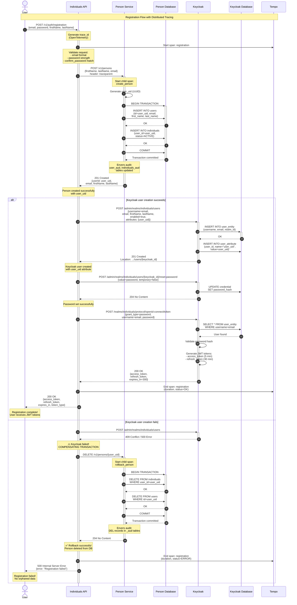

# Sequence Diagram — User Registration Flow

Полный процесс регистрации пользователя в системе с поддержкой компенсирующих транзакций.




## Описание шагов

### 1-3. Инициация запроса
User отправляет POST запрос на `/v1/auth/registration` с данными:
- email
- password
- confirm_password
- first_name
- last_name

Individuals API создаёт **trace_id** через OpenTelemetry Java Agent.

### 4-5. Валидация
API валидирует:
- Email format (RFC 5322)
- Password strength (мин. 8 символов, заглавные, цифры, спец. символы)
- confirm_password совпадает с password

### 6-14. Создание Person в Person Service
**Транзакционная операция**:
1. Генерируется `user_uid` (UUID)
2. Создаётся запись в `users` таблице
3. Создаётся запись в `individuals` таблице (ссылка на user_id)
4. COMMIT транзакции
5. Hibernate Envers создаёт audit записи в `users_aud` и `individuals_aud`

**Trace**: создаётся child span `create_person` с `traceparent` header

### 15-30. Happy Path: Успешная регистрация в Keycloak

#### 15-18. Регистрация в Keycloak
API вызывает Keycloak Admin API:
- Создаёт пользователя с `username=email`
- Добавляет **custom attribute** `user_uid` для связи с Person Service
- Keycloak возвращает Location header с ID созданного пользователя

#### 19-21. Установка пароля
API устанавливает password через `/reset-password` endpoint:
- `temporary=false` (пароль постоянный)
- Keycloak хеширует пароль (bcrypt) и сохраняет в БД

#### 22-28. Генерация JWT токенов
API вызывает Token endpoint Keycloak:
- `grant_type=password` (Resource Owner Password Credentials)
- Keycloak валидирует credentials
- Генерирует **access_token** (JWT, exp=5 min)
- Генерирует **refresh_token** (JWT, exp=30 min)

#### 29-30. Завершение
- API завершает span в Tempo
- Возвращает tokens пользователю
- **Полная трасса доступна в Grafana Tempo**

### 31-45. Error Path: Компенсирующая транзакция

#### 31-32. Ошибка создания Keycloak user
Keycloak возвращает ошибку:
- **409 Conflict** — пользователь с таким email уже существует
- **500 Internal Server Error** — внутренняя ошибка Keycloak

#### 33-41. Rollback person из БД
API инициирует **compensating transaction**:
1. Вызывает `DELETE /v1/persons/{user_uid}`
2. Person Service удаляет записи из `individuals` и `users` таблиц
3. Hibernate Envers создаёт audit записи об удалении
4. Возвращает `204 No Content`

**Критически важно**: rollback выполняется в обратном порядке создания!

#### 42-45. Возврат ошибки пользователю
- API завершает span с `status=ERROR`
- Возвращает `500 Internal Server Error` с оригинальной ошибкой Keycloak
- **Гарантия**: нет orphaned records в Person Service

## Error Handling & Resilience

### Сценарий 1: Person Service недоступен (шаг 6)
```
❌ Person Service: 503 Service Unavailable
→ API возвращает: 503 Service Unavailable
→ Rollback: НЕ НУЖЕН (транзакция не начата)
→ Состояние: Чистое, данных нет
```

### Сценарий 2: Ошибка создания Person (шаг 13)
```
❌ Person DB: ROLLBACK при ошибке INSERT
→ Person Service возвращает: 500 Internal Server Error
→ API возвращает: 500 Internal Server Error
→ Rollback: Автоматический (JDBC transaction)
→ Keycloak user: НЕ создаётся
→ Состояние: Чистое, данных нет
```

### Сценарий 3: Keycloak user creation fails (шаг 15) ✅ КОМПЕНСИРУЮЩАЯ ТРАНЗАКЦИЯ
```
✅ Person создан в БД
❌ Keycloak: 409 Conflict / 500 Error
→ API вызывает: DELETE /v1/persons/{user_uid}
→ Person Service: удаляет записи из БД
→ API возвращает: 500 Internal Server Error
→ Состояние: Чистое, Person удалён, orphaned data нет
```

**Важно**:
- Если DELETE тоже упадёт → логируется **CRITICAL error** для manual cleanup
- Оригинальная ошибка Keycloak сохраняется в `cause` exception

### Сценарий 4: Password set fails (шаг 19)
```
✅ Person создан в БД
✅ Keycloak user создан
❌ Password: 500 Error при set password
→ API возвращает: 500 Internal Server Error
→ Rollback: НЕ ВЫПОЛНЯЕТСЯ (Keycloak user уже создан)
→ Состояние: Inconsistent (user без пароля)
→ Решение: User может сделать "Forgot password"
```

**Примечание**: Это граница компенсации — после создания Keycloak user мы НЕ удаляем его, т.к. это может нарушить audit trail.

### Сценарий 5: Token generation fails (шаг 22)
```
✅ Person создан в БД
✅ Keycloak user создан с паролем
❌ Login: 401 Unauthorized / 500 Error
→ API возвращает: 500 Internal Server Error
→ Rollback: НЕ ВЫПОЛНЯЕТСЯ (всё создано успешно)
→ Состояние: OK (user может залогиниться через /v1/auth/login)
```

## Compensating Transaction Pattern

### Принципы реализации
```java
// UserService.java
public Mono<TokenResponse> register(UserRegistrationRequest request) {
    return personServiceClient.createPerson(request)
            .flatMap(personResponse -> {
                String userId = personResponse.getUserId().toString();

                return keycloakClient.createUserWithAttribute(email, password, userId)
                        .onErrorResume(keycloakError -> {
                            // COMPENSATING TRANSACTION
                            RuntimeException registrationError = new RuntimeException(
                                    "Registration failed: " + keycloakError.getMessage(),
                                    keycloakError
                            );

                            return personServiceClient.deletePerson(personResponse.getUserId())
                                    .doOnSuccess(v -> log.info("✅ Rollback successful"))
                                    .doOnError(deleteError -> log.error("🚨 CRITICAL: Rollback failed!"))
                                    .thenReturn(true)
                                    .onErrorReturn(false)
                                    .<Void>flatMap(deleteSucceeded -> Mono.error(registrationError));
                        })
                        .then(keycloakClient.login(email, password));
            });
}
```

### Ключевые моменты

1. **Обратный порядок**: Откат выполняется в порядке, обратном созданию
2. **Сохранение оригинальной ошибки**: `cause` содержит Keycloak error
3. **Логирование критических сбоев**: Если DELETE упал — CRITICAL log для manual cleanup
4. **Границы компенсации**: После создания Keycloak user откат не выполняется

## Tracing Information

Все компоненты экспортируют spans в **Tempo** через OpenTelemetry:

| Service | Span Name | Attributes | Status on Error |
|---------|-----------|------------|-----------------|
| individuals-api | `POST /v1/auth/registration` | http.method, http.url, http.status_code | ERROR |
| person-service | `POST /v1/persons` | http.method, http.url, user_uid | OK |
| person-service | `DELETE /v1/persons/{id}` | http.method, user_uid, compensating=true | OK (if rollback succeeds) |
| individuals-api | `POST /admin/.../users` | http.method, keycloak.realm | ERROR |

**Trace ID** доступен в логах:
```json
{
  "trace_id": "fb47b1deb3b6e4134167048b1ad49eda",
  "span_id": "a1b2c3d4e5f6g7h8",
  "message": "Registration failed for email: user@example.com",
  "level": "ERROR",
  "error.type": "RuntimeException",
  "error.message": "Registration failed: keycloak 409 conflict",
  "compensating_transaction": "DELETE /v1/persons/{user_uid}",
  "rollback_status": "SUCCESS"
}
```

Полная трасса с компенсирующей транзакцией видна в **Grafana → Explore → Tempo**:
```
registration (ERROR, 850ms)
  ├─ create_person (OK, 120ms)
  ├─ create_keycloak_user (ERROR, 200ms)
  └─ rollback_person (OK, 80ms) ← compensating transaction
```
