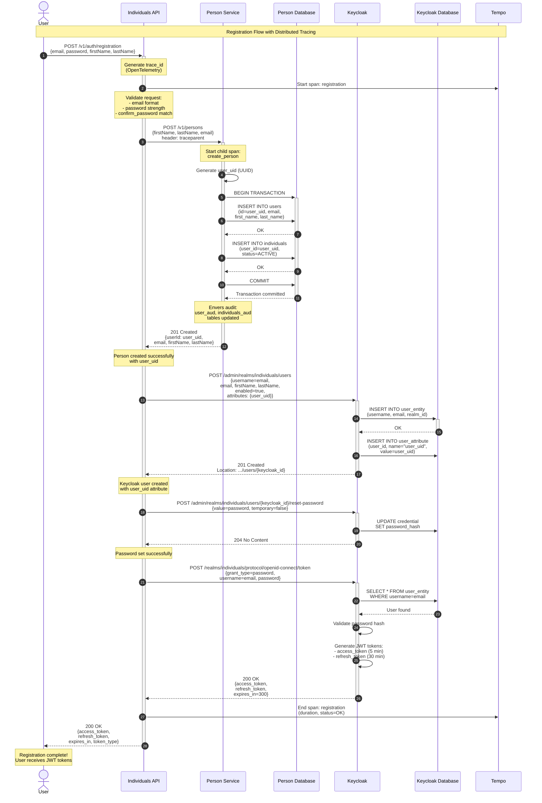

# Sequence Diagram — User Registration Flow

Полный процесс регистрации пользователя в системе.



## Описание шагов

### 1-3. Инициация запроса
User отправляет POST запрос на `/v1/auth/registration` с данными:
- email
- password
- confirm_password
- first_name
- last_name

Individuals API создаёт **trace_id** через OpenTelemetry Java Agent.

### 4-5. Валидация
API валидирует:
- Email format (RFC 5322)
- Password strength (мин. 8 символов, заглавные, цифры, спец. символы)
- confirm_password совпадает с password

### 6-14. Создание Person в Person Service
**Транзакционная операция**:
1. Генерируется `user_uid` (UUID)
2. Создаётся запись в `users` таблице
3. Создаётся запись в `individuals` таблице (ссылка на user_id)
4. COMMIT транзакции
5. Hibernate Envers создаёт audit записи в `users_aud` и `individuals_aud`

**Trace**: создаётся child span `create_person` с `traceparent` header

### 15-18. Регистрация в Keycloak
API вызывает Keycloak Admin API:
- Создаёт пользователя с `username=email`
- Добавляет **custom attribute** `user_uid` для связи с Person Service
- Keycloak возвращает Location header с ID созданного пользователя

### 19-21. Установка пароля
API устанавливает password через `/reset-password` endpoint:
- `temporary=false` (пароль постоянный)
- Keycloak хеширует пароль (bcrypt) и сохраняет в БД

### 22-28. Генерация JWT токенов
API вызывает Token endpoint Keycloak:
- `grant_type=password` (Resource Owner Password Credentials)
- Keycloak валидирует credentials
- Генерирует **access_token** (JWT, exp=5 min)
- Генерирует **refresh_token** (JWT, exp=30 min)

### 29-30. Завершение
- API завершает span в Tempo
- Возвращает tokens пользователю
- **Полная трасса доступна в Grafana Tempo**

## Error Handling

### Person Service недоступен (шаг 6)
→ API возвращает `503 Service Unavailable`  
→ Rollback не нужен (транзакция не начата)

### Ошибка создания Person (шаг 13)
→ Person Service делает ROLLBACK  
→ API возвращает `500 Internal Server Error`  
→ Keycloak user **не создаётся**

### Keycloak недоступен (шаг 15)
→ Person уже создан в БД  
→ API возвращает `503 Service Unavailable`  
→ **Inconsistency**: person есть, Keycloak user нет  
→ Требуется компенсирующая транзакция или retry logic

### Пароль не установлен (шаг 19)
→ Keycloak user создан, но без password  
→ API возвращает `500 Internal Server Error`  
→ User не может залогиниться (нужен manual reset)

### Token generation failed (шаг 22)
→ Всё создано, но токены не выданы  
→ API возвращает `500 Internal Server Error`  
→ User может залогиниться через `/v1/auth/login`

## Tracing Information

Все компоненты экспортируют spans в **Tempo** через OpenTelemetry:

| Service | Span Name | Attributes |
|---------|-----------|------------|
| individuals-api | `POST /v1/auth/registration` | http.method, http.url, http.status_code |
| person-service | `POST /v1/persons` | http.method, http.url, user_uid |
| individuals-api | `POST /admin/.../users` | http.method, keycloak.realm |
| individuals-api | `POST /.../token` | grant_type, username |

**Trace ID** доступен в логах:
```json
{"trace_id":"fb47b1deb3b6e4134167048b1ad49eda", "message":"Registration completed"}
```

Полная трасса видна в **Grafana → Explore → Tempo**.